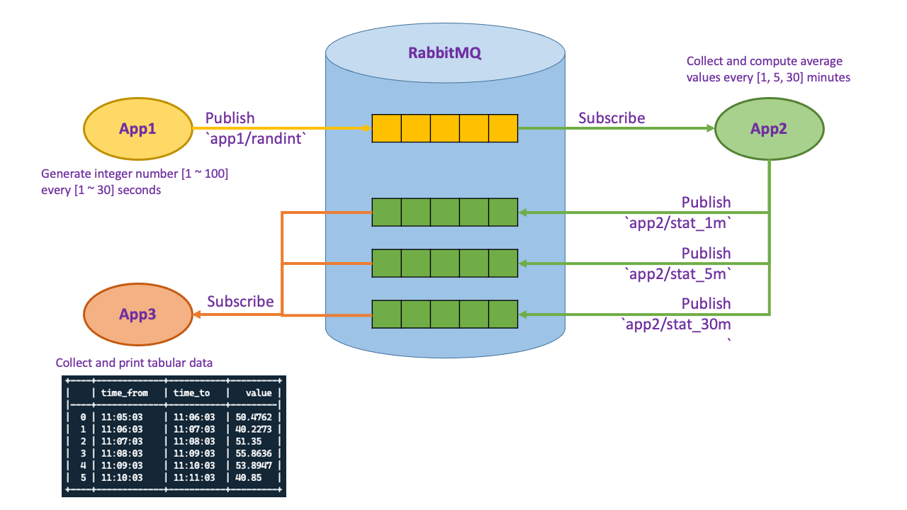

# Switchdin Challenge

Topic: Python Software Engineer (Embedded, Data Science)

# Application Description

Environment setup:
* MQTT message broker: RabbitMQ
* Publish/Subscribe library: paho-mqtt

System overview:


## Broker local setup
Initialise RabbitMQ server:
```
# Starting server
rabbitmq-server

# Enabling plugin
rabbitmq-plugins enable rabbitmq_mqtt

# Setup users and authentication
rabbitmqctl add_user mqtt-test mqtt-test
rabbitmqctl set_permissions -p / mqtt-test ".*" ".*" ".*"
rabbitmqctl set_user_tags mqtt-test management
```

Generate hidden environment file *(secret keys)*
* File name: `.env`
* File content:
```
MQTT-USERNAME = "mqtt-test"
MQTT-PASSWORD = "mqtt-test"
```

Configure host:
* Modify `host` in `config.json` to **"localhost"**.

## Broker cloud setup (AWS EC2 with docker)

*Prerequisite*: Installation Docker on Linux (for AWS EC2) -> read [here](https://docs.docker.com/engine/install/ubuntu/)

```
docker pull rabbitmq
sudo docker run -d -p 1883:1883 rabbitmq:latest
sudo docker container ps
# grab container name
sudo docker exec -it <container_name> sh

# <!-- Inside container --!>
rabbitmq-plugins enable rabbitmq_mqtt
rabbitmqctl add_user mqtt-test mqtt-test
rabbitmqctl set_permissions -p / mqtt-test ".*" ".*" ".*"
rabbitmqctl set_user_tags mqtt-test management
exit
# <!-- End container --!>
```

Configure host:
* Modify host in config.json to
**"3.106.129.172"** (AWS EC2 IP) <<< *CURRENT SETTINGS*

Open port of AWS EC2:
* Security group > Inbound rules > IPv4 > "All traffic" (all protocol, all port range, source=0.0.0.0/0) *(for demo only, not a good practice to open all the ports and inbound)*


## App1
Generates a random number between [1 and 100] every [1 to 30] seconds and publishes to broker with topic named `app1/randint`.

Run app:
```
cd src
python /app1.py
```
## App2
Subscribes to topic `app1/randint` and compute average every [1, 5, 30] minutes,
and publishes accordingly to broker with topics named `app2/stat_1m`, `app2/stat_5m`, `app2/stat_30m`.

Run app:
```
cd src
python /app2.py
```

## App3
Subscribes to topics `app2/stat_1m`, `app2/stat_5m`, `app2/stat_30m`, and prints out tabular view in console accordingly.

Run app:
```
cd src
python app3.py
```

# Demo


# Project timeline records
* Self-study & research: 1.5 day
* Implementation: 1 day
    * [x] Design: 30 minutes
    * [x] Coding: 2 hours
    * [x] Testing (local): 1 hour
    * [x] Deployment: 2 hour
    * [x] Testing (deploy): 1 hour
    * [x] Documentation: 1 hour

# References
1. RabbitMQ:
    * [cli guide](https://www.rabbitmq.com/cli.html)
    * [MQTT Plugin](https://www.rabbitmq.com/mqtt.html)
    * [Tutorials](https://www.rabbitmq.com/getstarted.html)
2. Paho MQTT:
    * [Installation and usage](https://pypi.org/project/paho-mqtt/)
    * [Documentations](https://www.eclipse.org/paho/index.php?page=clients/python/docs/index.php)
    * [Tutorials](http://www.steves-internet-guide.com/into-mqtt-python-client/)
3. Install docker on Linux:
    * [Installation guide](https://docs.docker.com/engine/install/ubuntu/)
